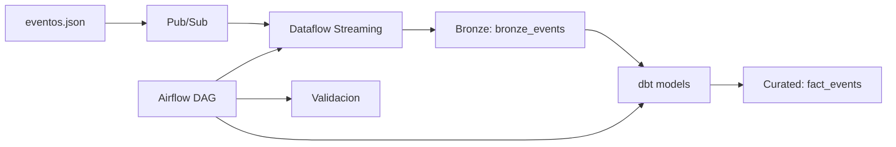

# Fase 6 - Pipeline automatizado con Dataflow, Airflow y dbt

## Objetivo
Automatizar la ingesta, el procesamiento y la transformacion de eventos en tiempo real mediante Pub/Sub, Dataflow, BigQuery y dbt, con orquestacion en Airflow.

## Arquitectura



### Flujo detallado
```
eventos.json
    |
    v
Pub/Sub (eventos-realtime)
    |
    v
Dataflow Streaming (Apache Beam)
    |
    v
BigQuery bronze_events
    |
    v
dbt models (staging -> marts)
    |
    v
BigQuery fact_events (curated)
    |
    v
Airflow: validate_data
```

## Stack tecnologico
| Componente | Tecnologia | Funcion |
|------------|------------|---------|
| Orquestacion | Apache Airflow 2.7.1 | DAG scheduler |
| Ingesta | Google Pub/Sub | Mensajeria en tiempo real |
| Procesamiento | Apache Beam / Dataflow | Streaming escalable |
| Transformacion | dbt (data build tool) | SQL modular y testable |
| Almacenamiento | Google BigQuery | Data warehouse analitico |

## Estructura del proyecto
```
dags/
  dag_eventos_realtime.py          # DAG principal (4 tasks)
  dependencies/task_factory.py     # Helpers para Airflow

dataflow/
  streaming_pipeline.py            # Pipeline Beam (Dataflow + DirectRunner)
  Dockerfile                       # Image para Flex Template

dbt/
  dbt_project.yml                  # Configuracion dbt
  profiles.yml                     # Conexion BigQuery
  models/
    staging/
      stg_bronze_events.sql        # Vista de limpieza
      schema.yml                   # Tests de calidad
    marts/
      fact_events.sql              # Tabla de hechos final
      schema.yml                   # Tests de la tabla final

ingestion/
  pubsub_publisher.py              # Simulador de ingesta
  setup_infrastructure.py          # Creacion de recursos GCP
  consumer_test.py                 # Consumidor de prueba

data/
  eventos_ing.json                 # Eventos generados
  generate/
    generate_events.py             # Generador de eventos
config/
  settings.py                      # Configuracion centralizada
sql/
  schemas/                         # DDL de tablas
  transforms/                      # SQL legacy (reemplazado por dbt)
tests/
  test_streaming_pipeline.py       # Tests del pipeline Beam
  test_dag_import.py               # Tests del DAG
  test_generate_events.py          # Tests del generador
  test_settings.py                 # Tests de configuracion
  test_task_factory.py             # Tests de helpers
```

## DAG de Airflow
El DAG `dag_eventos_realtime` ejecuta 4 tasks en secuencia:

```python
setup_infra >> launch_dataflow >> dbt_run >> validate_data
```

| Task | Descripcion |
|------|-------------|
| `setup_infrastructure` | Crea topic Pub/Sub, suscripcion y tablas BigQuery |
| `launch_dataflow_job` | Lanza job de streaming via Flex Template |
| `dbt_run` | Ejecuta `dbt run` para transformar bronze -> curated |
| `validate_data` | Valida cantidad de registros en bronze y curated |

## Ejecucion local (sin GCP)

### 1. Generar eventos
```bash
python data/generate/generate_events.py --num-events 500
```

### 2. Ejecutar pipeline con DirectRunner
```bash
python dataflow/streaming_pipeline.py --runner DirectRunner --input-file data/eventos_ing.json
```

### 3. Ejecutar tests
```bash
python -m pytest tests/ -v
```

### 4. Levantar Airflow
```bash
docker-compose up -d
```
Acceso: http://localhost:8080 (admin/admin)

## Despliegue en GCP

### 1. Configurar proyecto
```bash
gcloud config set project dataleaguenovaretail
```

### 2. Crear infraestructura
```bash
python ingestion/setup_infrastructure.py
```

### 3. Publicar eventos
```bash
python ingestion/pubsub_publisher.py --input data/eventos_ing.json --limit 10
```

### 4. Construir Flex Template
```bash
gcloud dataflow flex-template build gs://novaretail-dataflow-templates/pubsub-to-bq-streaming.json \
  --image-gcr-path="gcr.io/dataleaguenovaretail/dataflow/pubsub-to-bq:latest" \
  --sdk-language="PYTHON" \
  --flex-template-base-image="PYTHON3" \
  --metadata-file="dataflow/metadata.json" \
  --py-path="." \
  --env="FLEX_TEMPLATE_PYTHON_PY_MODULE=dataflow.streaming_pipeline"
```

### 5. Lanzar job
```bash
gcloud dataflow flex-template run "streaming-events-$(date +%Y%m%d-%H%M%S)" \
  --template-file-gcs-location="gs://novaretail-dataflow-templates/pubsub-to-bq-streaming.json" \
  --parameters="project=dataleaguenovaretail,topic=eventos-realtime,output-table=dataleaguenovaretail:nR_core_datasets.bronze_events,deadletter-table=dataleaguenovaretail:nR_core_datasets.deadletter_events" \
  --region=us-south1
```

### 6. Ejecutar dbt (desde Airflow o manual)
```bash
cd dbt
dbt deps
dbt run
```

## Justificacion de arquitectura

### Por que Dataflow (Apache Beam)?
- **Serverless**: Sin manejo de clusters
- **Escalabilidad automatica**: Se ajusta a la carga
- **Streaming nativo**: Procesa eventos en tiempo real
- **Deadletter automatico**: Manejo de errores integrado

### Por que dbt?
- **SQL modular**: Transformaciones mantenibles
- **Testing automatico**: Validacion de calidad de datos
- **Documentacion**: Generada automaticamente
- **Lineage**: Dependencias entre modelos

### Por que Airflow?
- **Orquestacion central**: Coordina todos los componentes
- **Monitoreo**: UI para visualizar pipelines
- **Reintentos**: Manejo de fallos automatico
- **Programacion**: Cron-like para ejecuciones periodicas

### Patron Medallion (Bronze -> Curated)
- **Bronze**: Datos crudos tal como llegan
- **Staging**: Limpieza y validacion basica
- **Curated/Marts**: Datos listos para analitica

## Entregables de la Fase 6
- [x] DAG funcional con 4 tasks
- [x] Diagrama tecnico (README + mermaid)
- [x] Justificacion de arquitectura
- [x] Soporte DirectRunner (testing local)
- [x] Modelos dbt con tests
- [x] Generador de eventos mejorado
