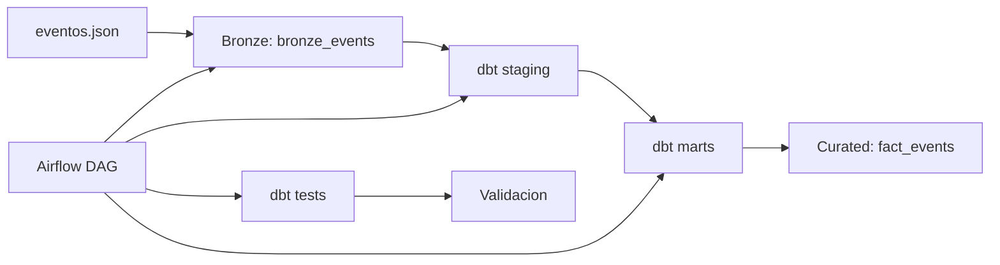

# Fase 6 - Pipeline automatizado con BigQuery, Airflow y dbt

## Objetivo
Automatizar la ingesta, el procesamiento y la transformacion de eventos en tiempo real mediante un pipeline medallion (bronze -> curated) con orquestacion en Airflow, transformaciones en dbt y almacenamiento en BigQuery.

## Arquitectura



### Flujo detallado
```
eventos.json (500 eventos generados)
    |
    v
BigQuery bronze_events (ingesta raw)
    |
    v
dbt: stg_bronze_events (limpieza + validacion)
    |
    v
dbt: fact_events (tabla curada)
    |
    v
dbt test (quality checks)
    |
    v
Validacion de registros
```

## Stack tecnologico
| Componente | Tecnologia | Funcion |
|------------|------------|---------|
| Orquestacion | Apache Airflow 2.7.1 | DAG scheduler (Docker) |
| Transformacion | dbt 1.12.0 | SQL modular y testable |
| Almacenamiento | Google BigQuery | Data warehouse analitico |
| Ingesta | Google Cloud Python Client | Carga directa a BigQuery |
| Testing | pytest + dbt tests | Validacion end-to-end |

### Stack local (testing)
| Componente | Tecnologia | Funcion |
|------------|------------|---------|
| Pipeline | Apache Beam 2.75.0 | Procesamiento DirectRunner |
| Generador | Python CLI | Generacion de eventos |

## Estructura del proyecto
```
dags/
  dag_eventos_realtime.py          # DAG principal (5 tasks)
  dependencies/task_factory.py     # Helpers para Airflow

dataflow/
  streaming_pipeline.py            # Pipeline Beam (Dataflow + DirectRunner)

dbt/
  dbt_project.yml                  # Configuracion dbt
  profiles.yml                     # Conexion BigQuery
  models/
    staging/
      stg_bronze_events.sql        # Vista de limpieza
      schema.yml                   # Tests de calidad
    marts/
      fact_events.sql              # Tabla de hechos final
      schema.yml                   # Tests de la tabla final

ingestion/
  pubsub_publisher.py              # Simulador de ingesta Pub/Sub
  setup_infrastructure.py          # Creacion de recursos GCP

data/
  eventos_ing.json                 # 500 eventos generados
  generate/
    generate_events.py             # Generador CLI con seed

config/
  settings.py                      # Configuracion centralizada
tests/
  test_streaming_pipeline.py       # Tests del pipeline Beam
  test_dag_import.py               # Tests de estructura del DAG
  test_generate_events.py          # Tests del generador
  test_settings.py                 # Tests de configuracion
  test_task_factory.py             # Tests de helpers
```

## DAG de Airflow
El DAG `dag_eventos_realtime` ejecuta 5 tasks en secuencia:

```python
setup_infra >> launch_dataflow >> dbt_run >> dbt_test >> validate_data
```

| Task | Tipo | Descripcion |
|------|------|-------------|
| `setup_infrastructure` | PythonOperator | Crea topic Pub/Sub, suscripcion y tablas BigQuery |
| `launch_dataflow_job` | PythonOperator | Lee eventos JSON y los escribe a BigQuery |
| `dbt_run` | BashOperator | Ejecuta `dbt run` para transformar bronze -> curated |
| `dbt_test` | BashOperator | Ejecuta `dbt test` para validar calidad de datos |
| `validate_data` | PythonOperator | Valida cantidad de registros en bronze y curated |

### Schedule
- Frecuencia: cada 10 minutos (`*/10 * * * *`)
- catchup: desactivado (no ejecuta rangos atrasados)
- Retries: 2 por task, delay de 2 minutos

### Tests de dbt
Los tests verifican automaticamente en cada ejecucion:
- **Unicidad** de `event_id` en bronze y curated
- **No nulidad** en campos criticos (`event_id`, `date_id`, `ingestion_time`)
- **Valores aceptados** en `event_type` (login, view, add_to_cart, checkout, purchase, cart_abandoned)
- **No nulidad** de `transformed_at` en fact_events

## Ejecucion local

### 1. Generar eventos
```bash
python data/generate/generate_events.py --num-events 500 --seed 42
```

### 2. Ejecutar pipeline con DirectRunner
```bash
python dataflow/streaming_pipeline.py --runner DirectRunner --input-file data/eventos_ing.json
```

### 3. Ejecutar tests
```bash
python -m pytest tests/ -v
```

### 4. Levantar Airflow
```bash
docker-compose up --build -d
```
Acceso: http://localhost:8080 (admin/admin)

### 5. Parar Airflow
```bash
docker-compose down
```


### Credenciales GCP
El archivo `config/gcp_credentials.json` contiene la service account de GCP.

## Justificacion de arquitectura

### Patron Medallion (Bronze -> Curated)
- **Bronze**: Datos crudos tal como llegan del generador/ingesta
- **Staging**: Limpieza, tipado y validacion basica (dbt)
- **Marts**: Datos transformados y listos para analitica

### Por que dbt?
- **SQL modular**: Transformaciones mantenibles y versionables
- **Testing automatico**: Validacion de calidad de datos en cada ejecucion
- **Documentacion**: Descripciones auto-generadas de modelos y columnas
- **Lineage**: Dependencias claras entre modelos (staging -> marts)

### Por que Airflow?
- **Orquestacion central**: Coordina ingesta, transformacion y validacion
- **Monitoreo**: UI para visualizar estado de pipelines y logs
- **Reintentos**: Manejo de fallos automatico con backoff
- **Programacion**: Cron-like para ejecuciones periodicas

### Por que BigQuery?
- **Serverless**: Sin gestion de infraestructura
- **Free tier**: 1 TB de queries y 10 GB de almacenamiento gratis al mes
- **Integracion nativa**: Conectores oficiales de Python y dbt

